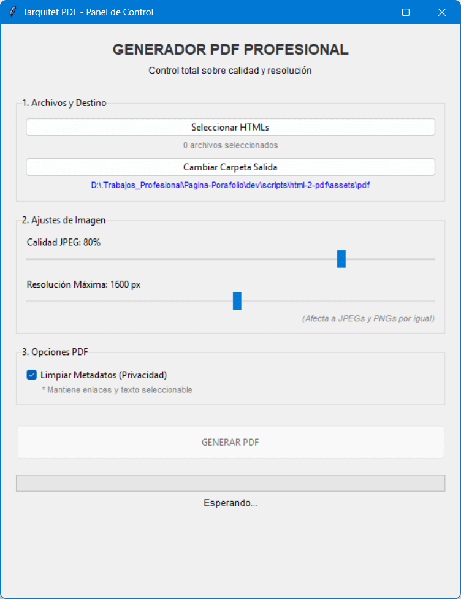

# 📄 HTML to PDF Generator (Ultimate Edition)

> **A professional tool that converts local HTML files into optimized PDFs, solving lazy-loading issues and greatly reducing final file size.**

HTML to PDF Generator is a desktop Python tool using Playwright (Chromium) to ensure perfect CSS/JS rendering and applies PyMuPDF post-processing to optimize images without losing visual quality.



## ✨ Main Features (v5)

- **Local Temporary Server:** Prevents browser CORS issues with local files by serving resources and fonts correctly.
- **Auto-Scroll for Lazy-Loading:** Injects a script that scrolls the page to force lazy-loaded images to load before capture.
- **Hybrid Compression Engine:** Chooses PNG for images with transparency and JPEG for opaque images using configurable quality.
- **Metadata Cleanup:** Removes EXIF and PDF metadata (Author, Creation Date, Software) for privacy and smaller files.
- **Smart Multi-language Naming:** Detects `-en` or `_en` suffixes to name PDFs accordingly (e.g. `CV_David_Pinto_ENG.pdf`).

---

## ⚙️ Requirements & Installation

The script includes a robust auto-installer that downloads required Python packages and installs Chromium for Playwright on first run.

**Requirements:**

- Python 3.8 or newer.

**Dependencies (installed automatically):**

- `playwright` (rendering)
- `pymupdf` / `fitz` (PDF processing)
- `pillow` (image processing)

Run:

```bash
python 5_HTML-2-PDF-Python.py
```

Note: first run may take a couple of minutes while Playwright downloads Chromium.

[](README_es.md)

## Quick Usage

- Add HTML files using the ➕ button.
- Set JPEG quality (recommended ~75%).
- Optionally remove metadata for privacy.
- Choose output folder and press Generate.

## Changelog Overview

- v0: Initial Playwright + server and auto-scroll.
- v1: Optimized scaling for very large images.
- v2: Privacy mode (no metadata).
- v3-v4: Hybrid PNG/JPEG engine improvements.
- v5: Smart renaming and removal of trailing blank pages.

```

```
